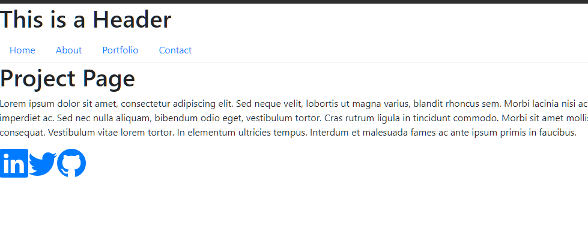

# React Portfolio

## Description

A basic SPA portfolio style app built using React.

Please note this application is a rough draft to show comprehension of concepts rather than a finished app with CSS styling etc. All things are a work in progress.
  
--- 

## https://lancebailey26.github.io/reactportfolio/

## https://github.com/lancebailey26/reactportfolio

--- 

## Installation

npm i to install packages, then npm start.

--- 

## Usage

Navigate to different sections using the nav bar.

## Credits

n/a

## Copyright Lance Bailey 09/25/2021 License: MIT License